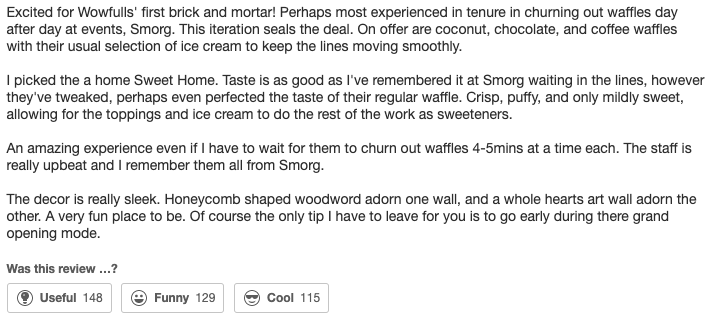
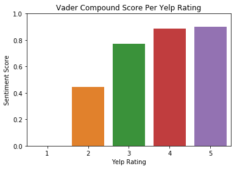
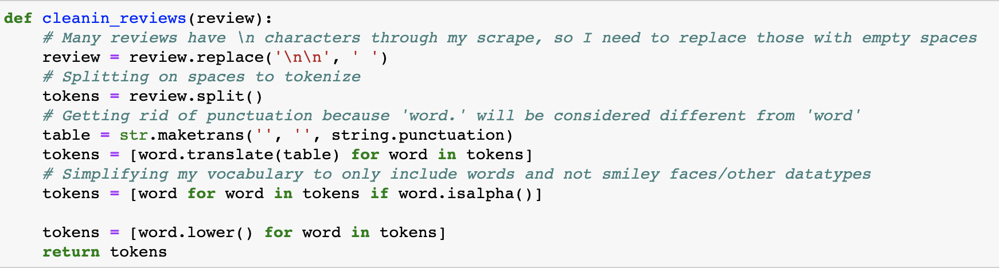
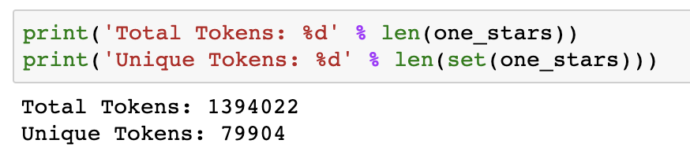
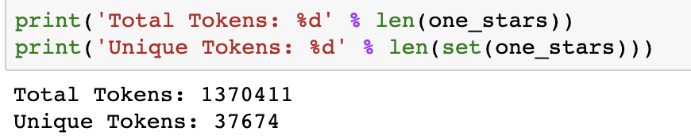
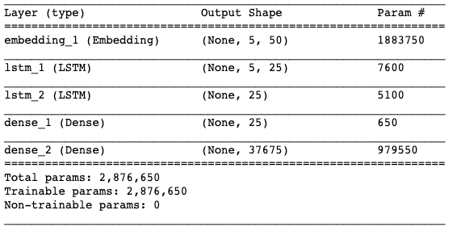
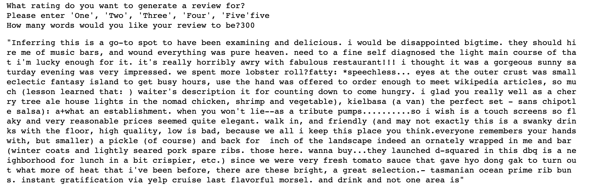
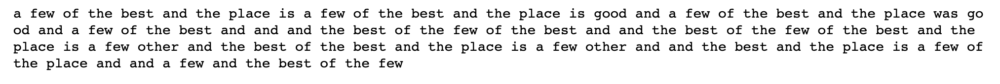
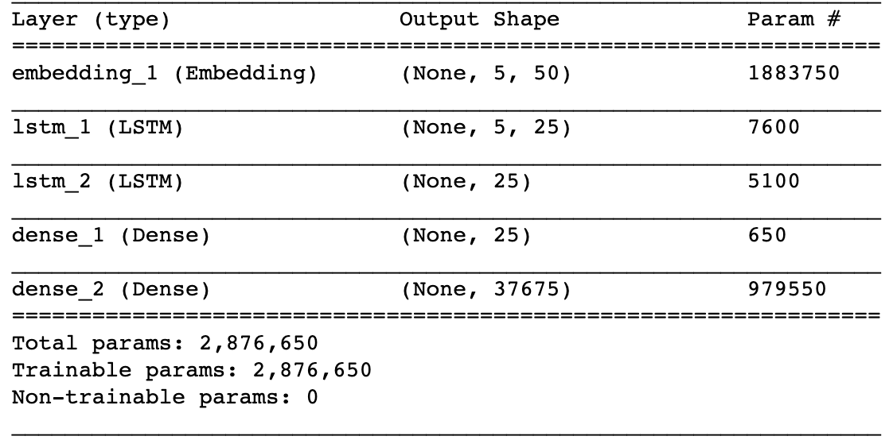

# Yelp-Review-Generator

## Project Overview

This project uses data scraped from Yelp and through natural language processing and neural networks, I have developed a text generator that will create a review post based on the rating you want to give a particular establishment. The goal of this model is to create a template for you which you can tweak slightly and post the review onto your account. This will save you a lot of time as the model has been trained on thousands of reviews for each star rating, allowing this text generator to capture the general sentiment you may be feeling for the star rating you want to provide.

## Initial EDA

I wanted to see what types of reviews users found to be funny, cool, and useful. Please see below for the top reviews from my initial scrape.

  <u><b> Funniest and Cool Review </b></u>

 

  

  <u><b> Most Useful Review </b></u>

 

  

Because I want to run a model for each star rating, based on my rating distribution below, I will need additional datapoints for 1, 2, and 3 star ratings. As such, in addition to the scraped reviews, I will be using the Yelp Dataset they make available every year. 

  <u><b> Distribution of Ratings </b></u>

 

  

While I wanted to initially include the most funny, cool, and useful reviews from the Yelp Dataset as well, these reviews were all about Amy's Baking Company which was features on Gordon Ramsey's show "Kitchen Nightmares". As such, I am excluding them but including the distribution of the ratings from this dataset.

  <u><b> Distribution of Ratings From Yelp Dataset </b></u>

 

  

After taking a look through my dataset, I broke out the reviews by rating and performed a sentiment analysis using VADER (Valence Aware Dictionary and Sentiment Reasoner) to see the distribution of the compound scores amongst the different ratings. As you can see below, the average compound score as per VADER increases as the ratings increase, which is in line with what you would expect as a higher rating indicates a more positive experience.

  <u><b> Distribution of VADER Scores </b></u>

 

  

## Basic Text Generator

Using pure NLP, I want to establish a baseline for my text generator using the 30 most common words found in each star rating. For this, I used spacy to get the lemma of the words in my review dataset and also to tokenize them. Spacy is one of the newest algorithms that offer part of speech tagging for lemmatization and tokenization which is why I ended up using it. Please see below for the text generated for each star rating:

  <u><b> Basic Text Generated </b></u>

 

  

To go further with this and see if the text generated matched the sentiment seen in the VADER scores above, I did a sentiment analysis of the text generated. As you can see below, the sentiment of the top 30 words generated from each of the ratings is overwhelmingly positive from a VADER standpoint. You can also see that each rating share many words in common which just means all reviews share a common pattern when they are written out.

  <u><b> Sentiment of Text Generated </b></u>

 

  

We will need to develop a more robust model that takes into account the average sentiment that we have seen in the NLP EDA book which is much more representative of the negative views of the lower stars and the positive views of the 4 and 5 star ratings. For this, we will use neural networks.

## Basic Neural Networks

The goal of the neural network is to generate a sequence of texts given an input sequence (based on training data). A random number generator will select a sample line from the reviews I use to train my model and will predict the word with the highest probability based on the sequence of texts. Since the accuracy won't be 100%, the output won't be a direct copy of the seed text and instead will be a uniquely generated review. This loop will continue until the number of words the end user chooses has been reached. 

  <u><b> Cleaning Text </b></u>

For reference, please refer to the LSTM Text Generator notebook.

To perform the EDA above, my reviews were in a pandas dataframe along with other information related to each review, such as sentiment, Cool, Helpful, etc. 

I extracted the text of the reviews out from the pandas by converting the text column into a list and thus being able to clean up all the reviews at once by parsing through the list.

This was a highly iterative process because of issues presented by hardware limitations. For my project, I ended up removing punctuation to keep the unique tokens to a low enough count to not blow up my RAM. The reason for this is because "word" and "word." will be considered unique tokens and thus greatly increase the number of unique tokens that I would be basing the architecture of my neural network.

  <u><b> Function used to clean text </b></u>

 

  

Using the function above, I removed text issues such as '\n\n' which is a symptom of the scrape as well as all punctuation. The number of unique tokens were nearly cut in half after removing them which made it slightly easier to run the models on my personal computer due to issues experienced with Google Colab and Google Cloud Platform.

Please see below for the number of unique tokens with and without punctuation:

  <u><b> Function used to clean text </b></u>

 

  

  <u><b> Function used to clean text </b></u>

 

  

Once the text was tokenized, I made sequences of 5 + 1 words. So imagine a magnifying glass on words 1-5, then shifting it over to 2-6, 3-7, etc. While most common values are 50 or even 100, because my dataset consists of many individual reviews of varying sizes, I did not believe a larger value size of 50 words would be representative of my population of reviews. A smaller length of 5 would be able to capture the context of each individual review better and thus maintain consistent ideas through the entire sequence of words which would make a sentence. However, I believe my models lacked predictive powerbecause of this limitiation. 

The more inputs you provide (i.e. 50 tokens to predict the 51st token) the more data points you are giving the model to add weights to and better understand the sequence of words. With only 5 words, my initial models really lacked predictive power which resulted in an accuracy score of only 18%. 

  <u><b> Why LSTM? </b></u>

A typical feedforward network would not be as capable in recognizing patterns in text since the examples just go in one direction until the model makes a decision. Text is similar to time series in that the previous result has an impact on the current input. In simpler terms, words are related to each other and the previous word impacts the next word selected. Therefore, a model needs to be able to be able to recognize the current input as well as the previous inputs to establish the connection between the words. Because RNN's are a type of artificial neural network capable of identifying patterns in sequences of text, it was a natural choice to use for my deep learning model. 

However, I ended up using the LSTM variant of RNN's because text data is susceptible to exploding and vanishing gradients. Since the inputs go through many stages of multiplication (the fourth input weighs in the third, which weighs the second, which weighs the first, etc). So by multiplying an input by a value less than one or greater than one can lead to the gradients, which expresses the change in the weights of the inputs, to be very small (vanishing) or very large (exploding).

  <u><b> First Neural Network </b></u>

  

The picture above represents my first LSTM Neural Network architecture. Due to the blackbox nature of neural networks, I cautioned on the side of making it too simple than too complex. However, the other factor in my decision of these parameters was the execution time. Adding more layers or more memory cells would have made my run time longer and because of the issues I experienced with Google Colab (Insufficient Ram to load the model) and Google Cloud Platform (Could not get jupyter notebook to run on the cloud session), I had to run everything locally on my Macbook Pro. The model above at 25 epochs and a batch size of 256 took over 12 hours to run.

So despite cutting corners and not establishing the best model, the run time of my LSTM model was still half a day. However, because I cut corners with the large batch size and low epoch count, my accuracy only reached 17.77% which lead to a very poor predictor. 

  <u><b> Basic LSTM Generator </b></u>

  

As you can see above, the first 5 words are the seed words and the remainder of the sentence ends up being repetitive nonsense. This is an indication of a poorly trained model. However, with the intense time it took to run this, I decided to come up with an alternative text generator which was much simpler to run and much better than this.

## Enter Markov Chain

Markov Chain is a stochastic model where the probability of each event depends only on the previous event. To put this relating to text generation, a word is only generated based on the previous word. 

To build out this model, I combined all the reviews into one text file and made a dictionary where the keys were the unique words in the file and the values were every single word that occurred directly after the word. So if the word 'happy' appeared three times, the values of this key would be the words that occurred after each instance of 'happy'.

  <u><b> Markov Chain Generator </b></u>

  

As you can see in the image above, the text generated reads like english. This is because every 2 words will make sense next to each other because each word generated is directly dependent on the word before it. However, just because every 2 words will make sense next to each other, the text generated doesn't make too much sense at a sentence level and definitely not at a review level. 

To see if I could generate a few words that made sense as a generated review, I went back to neural networks and tried making a more robust model while taking into account the time and hardware limitations I had.

## Back to Neural Networks
Due to issues I faced running Google Cloud Platform and AWS, as well as the memory limitations of Google Colab, I broke up my data set for my 5 star reviews into 12 parts and increased the memory cells from 25 to 100. However, I kept my epochs to 25 and trained my model for all 12 parts. The following is a typical output I get:

  <u><b> More Memory Cell RNN </b></u>

  

Unfortunately, my output was still rubbish. My accuracy achieved was similar to my basic model and I believe this is directly due to my 25 epochs. Both models were limited to just 25 epochs and both had similar results despite my new model having more memory cells. Increasing the epochs and possibly adding another layer to my model may lead to better results. With that hypothesis, I moved onto redefining my model architecture.

  <u><b> Initial LSTM Model </b></u>

  

  <u><b> More Memory Cell LSTM Model </b></u>

  

  <u><b> More Layers LSTM Model </b></u>

  

In addition to the added layers in my final and best model, I also trained it for 100 epochs instead of the 25. The increased time it took to run this model was worth the effort as the output was much stronger than what the previous 2 LSTM models had. The result was unique words that almost made sense at a sentence level. Unfortunately, the output does not pass the eye test of a real review as it makes no sense. 

  <u><b> Example output from best model </b></u>

  

## Conclusion and Next Steps
This was a very interesting project for me and I think Natural Language Processing is a very cool topic that is also very hard to work with. There is a lot you can analyze with text and no 2 NLP projects will be the same because the stop words may be different for each project. Generating new text is a very difficult task and I understood why a yelp-review generator hasn't been made yet. Trying to train a model to understand patterns of text of thousands of different users is incredibly hard because every person has a different writing style so trying to combine all of them and training basic models that I ran will not yield the results one would hope for. 

Going forward, I would like to run my more robust model for the all of the other review dataframes I have. I only had time to run it for my smallest dataframe, the 4 star reviews, during my time at Flatiron School. I want to be able to have the generator learn on punctuation so my predictions read more like english rather than an x-length of lower-case words. Obviously, the more complicated I make my model, the better it will read, but running neural networks is very computationally expensive. 
